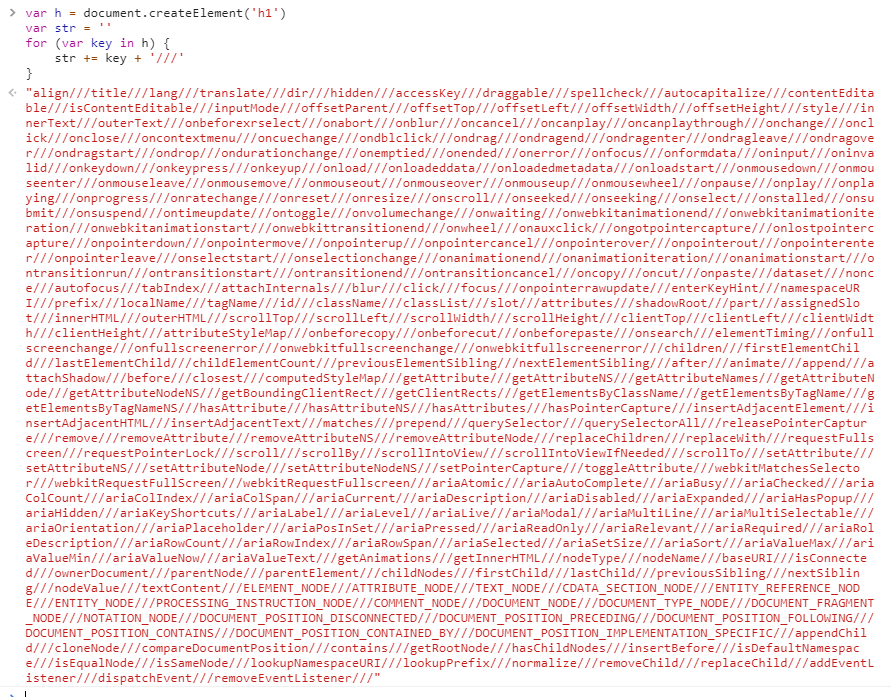

### 1. WHAT-Virtual DOM
> 真正的`DOM`元素是非常庞大的树形数据结构，而`Virtual DOM`本质上是一种轻量级的`JavaScript`数据格式，用于表示真实`DOM`在给定时间点的外观。`Virtual DOM`只是一个对象，它会有一个标签，表示它是一个`div`，它还有一个数据对象，其中包含可能的属性，它还可以存在一个子列表，表示更多的虚拟节点的数组。这样就可以构成虚拟`DOM`的虚拟节点树。
- 真实DOM
  
  可以看到，真正的`DOM`元素是非常庞大的，当我们频繁的去做`DOM`的更新操作时，会产生一定的性能问题。
- 虚拟DOM
  ```
    {
      "tag": "h1",
      "children": [
        {
          "text": ""
        }
      ],
      ......
    }
  ```
  `Virtual DOM`就是用一个原生的`JS`对象去描述一个`DOM`节点。在`Vue`中是通过`VNode`这个`Class`类去描述定义虚拟`DOM`的。
  ```
    export default class VNode {
      tag: string | void;
      data: VNodeData | void;
      children: ?Array<VNode>;
      text: string | void;
      elm: Node | void;
      ns: string | void;
      context: Component | void; // rendered in this component's scope
      key: string | number | void;
      componentOptions: VNodeComponentOptions | void;
      componentInstance: Component | void; // component instance
      parent: VNode | void; // component placeholder node

      // strictly internal
      raw: boolean; // contains raw HTML? (server only)
      isStatic: boolean; // hoisted static node
      isRootInsert: boolean; // necessary for enter transition check
      isComment: boolean; // empty comment placeholder?
      isCloned: boolean; // is a cloned node?
      isOnce: boolean; // is a v-once node?
      asyncFactory: Function | void; // async component factory function
      asyncMeta: Object | void;
      isAsyncPlaceholder: boolean;
      ssrContext: Object | void;
      fnContext: Component | void; // real context vm for functional nodes
      fnOptions: ?ComponentOptions; // for SSR caching
      fnScopeId: ?string; // functional scope id support

      constructor (
        tag?: string,
        data?: VNodeData,
        children?: ?Array<VNode>,
        text?: string,
        elm?: Node,
        context?: Component,
        componentOptions?: VNodeComponentOptions,
        asyncFactory?: Function
      ) {
        this.tag = tag
        this.data = data
        this.children = children
        this.text = text
        this.elm = elm
        this.ns = undefined
        this.context = context
        this.fnContext = undefined
        this.fnOptions = undefined
        this.fnScopeId = undefined
        this.key = data && data.key
        this.componentOptions = componentOptions
        this.componentInstance = undefined
        this.parent = undefined
        this.raw = false
        this.isStatic = false
        this.isRootInsert = true
        this.isComment = false
        this.isCloned = false
        this.isOnce = false
        this.asyncFactory = asyncFactory
        this.asyncMeta = undefined
        this.isAsyncPlaceholder = false
      }

      // DEPRECATED: alias for componentInstance for backwards compat.
      /* istanbul ignore next */
      get child (): Component | void {
        return this.componentInstance
      }
    }
  ```
  其中包含了一些`Vue`的特性。
### 2. WHY-Virtual DOM
> 虚拟`DOM`的出现当然是为了性能而考虑的，假设我们有1000个元素的列表。创建1000个`JavaScript`对象，可以很快，但是创建1000个实际的`div`节点却会消耗太多的性能。`VNode`是对真实`DOM`的一种抽象描述，它的核心定义包含几个关键属性，标签名、数据、子节点、键值等，其他属性都是用来扩展`VNode`的灵活性以及实现一些特殊`feature`的。由于`VNode`只是用来映射到真实`DOM`的渲染，不需要包含操作`DOM`的方法，因此它是非常轻量和简单的。